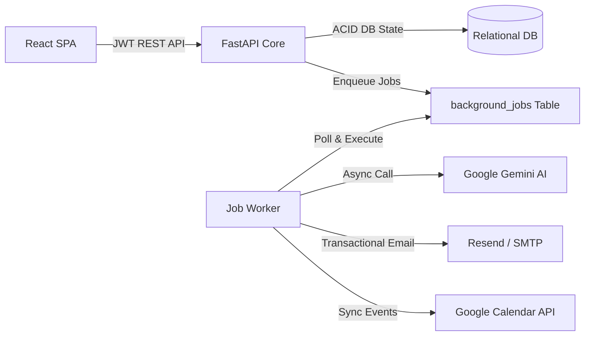

# Clinica System Design Document

## 1. Overall Architecture & Component Interactions
Clinica is structured around an asynchronous, decoupled multi-tier architecture:
- **Client Layer**: React 19 single-page application communicating via REST APIs with signed JWT bearer tokens.
- **Application Layer**: FastAPI application encapsulating core business engines:
  - `SlotService` and `AppointmentService` managing concurrency and scheduling state machines.
  - `DoctorLeaveService` orchestrating schedule conflict analysis and atomic cancellation.
  - `AIService` routing requests to Google Gemini with JSON schema enforcement.
  - `NotificationService` handling multi-channel communications.
  - `JobManager` driving the database-backed asynchronous background job queue.
- **Persistence Layer**: SQLAlchemy 2.0 ORM over relational storage (PostgreSQL/SQLite) with ACID transaction boundaries and composite unique constraints ensuring relational integrity.



---

## 2. Double-Booking Prevention & Concurrent Slot Booking
Double-booking under high concurrent traffic is prevented via a dual-layer strategy combining database-level unique constraints with atomic Optimistic Concurrency Control (OCC):

1. **Relational Constraints**:
   - The `slots` table enforces `UniqueConstraint("doctor_id", "start_time", name="uq_doctor_slot_start")`, preventing duplicate slot intervals per physician.
   - The `appointments` table enforces a unique constraint on `slot_id` (`ForeignKey("slots.id", unique=True)`), mathematically preventing more than one appointment from attaching to a single slot.

2. **Atomic Compare-And-Swap (CAS) Confirmation**:
   When confirming an appointment, `AppointmentService.confirm_appointment` executes an atomic conditional update:
   ```sql
   UPDATE slots
   SET status = 'BOOKED', hold_expires_at = NULL, version = version + 1
   WHERE id = :slot_id
     AND status = 'HELD'
     AND held_by_patient_id = :patient_id
     AND hold_expires_at >= :now;
   ```
   If concurrent requests attempt to book the same slot, the database serializes row execution. Exactly one request updates `rows_updated == 1` and proceeds to create the `Appointment` record. Any competing request receives `rows_updated == 0`, immediately rolls back, and returns an HTTP `409 Conflict`.

---

## 3. Slot Hold Mechanism & Hold Expiration
To prevent race conditions during booking without blocking database threads, Clinica uses an optimistic 5-minute slot reservation state machine:

1. **Acquiring a Hold**:
   When a patient selects a slot, `AppointmentService.hold_slot` runs an atomic CAS query:
   ```sql
   UPDATE slots
   SET status = 'HELD', held_by_patient_id = :patient_id,
       hold_expires_at = :expires_at, version = version + 1
   WHERE id = :slot_id
     AND (status = 'AVAILABLE' OR (status = 'HELD' AND hold_expires_at < :now));
   ```
   This atomically transitions available or expired slots to `HELD` for 5 minutes (`SLOT_HOLD_DURATION_MINUTES`).

2. **Lazy and Explicit Expiration**:
   - **Lazy Release**: Expired holds require no polling cleanup task. The CAS condition evaluates `hold_expires_at < :now` inline, allowing immediate re-reservation.
   - **Query-Time Sweep**: Slot fetch queries (`SlotService.get_doctor_slots`) automatically sweep and reset expired holds (`status = 'AVAILABLE'`, `held_by_patient_id = NULL`).
   - **Manual Release**: Patients navigating away trigger `DELETE /appointments/slots/{id}/hold`, immediately freeing the slot.

---

## 4. Doctor Leave & Existing-Appointment Conflict Handling
Physician leave management balances doctor schedule changes with patient continuity:

1. **Conflict Preview**: `DoctorLeaveService.preview_leave` performs a read-only query joining `appointments` and `slots` over the requested date range, identifying affected consultations without modifying state.
2. **Multi-Stage Review**: Doctors submit leave requests in `PENDING` status. Patient bookings remain active until administrative review.
3. **Atomic Disruption Execution**: Upon admin approval (`DoctorLeaveService.approve_leave`), an ACID transaction executes:
   - Conflicting `CONFIRMED` appointments are updated to `CANCELLED` with reason `"Doctor on approved leave (start – end)"`.
   - Conflicting slot rows are reset to `AVAILABLE` (`held_by_patient_id = NULL`).
   - Pending 24h appointment reminder background jobs for cancelled appointments are marked `FAILED`.
   - Individualized `NOTIFY_DOCTOR_LEAVE` jobs are enqueued for each patient.
4. **Reschedule Engine**: Patients or doctors can reschedule leave-disrupted appointments via `POST /appointments/{id}/reschedule`, atomically holding and booking a new slot while preserving medical history.

---

## 5. Notification Failure Handling, Retries & Background Jobs
Clinica enforces complete transaction isolation between core scheduling and third-party external networks (Resend, Gemini, Google Calendar):

1. **Non-Blocking Execution**: Database commits complete in milliseconds. All email dispatches and calendar synchronizations are enqueued into the `background_jobs` table with `status = 'PENDING'` and a target `scheduled_at` timestamp.
2. **Exponential Backoff Retries**:
   When a worker processes a job (`JobManager.process_job`), network failures or rate limits are caught safely:
   - Database appointment records remain `CONFIRMED` and are never rolled back.
   - The job increments `attempts`. If `attempts < max_attempts (3)`, status reverts to `PENDING` with exponential backoff:
     $$\text{backoff\_seconds} = \min(300, 2^{\text{attempts}} \times 5)$$
   - Upon exhausting 3 attempts, status transitions to `FAILED` with logged error traces.
3. **In-App Notification Decoupling**: In-app `Notification` rows are written directly to the database. Even during total email provider downtime, patients and doctors receive full notification records within their portal.
